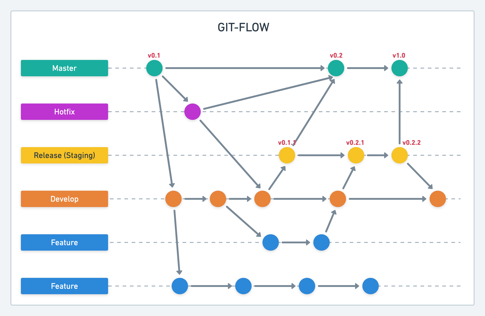

This is a [Next.js](https://nextjs.org/) project bootstrapped with [`create-next-app`](https://github.com/vercel/next.js/tree/canary/packages/create-next-app).

## Getting Started

- First, copy `.env.local.example` to `.env.local` and update the value for each item.

  > Please don't commit any `.env*` to git repo.

  > If you have new variables, please also update to `.env.example` (only keys)

- Then, run the development server:

  ```bash
  npm run dev
  # or
  yarn dev
  ```

Open [http://localhost:3000](http://localhost:3000) with your browser to see the result.

You can start editing the page by modifying `pages/index.tsx`. The page auto-updates as you edit the file.

[API routes](https://nextjs.org/docs/api-routes/introduction) can be accessed on [http://localhost:3000/api/hello](http://localhost:3000/api/hello). This endpoint can be edited in `pages/api/hello.tsx`.

The `pages/api` directory is mapped to `/api/*`. Files in this directory are treated as [API routes](https://nextjs.org/docs/api-routes/introduction) instead of React pages.

## Learn More

To learn more about Next.js, take a look at the following resources:

- [Next.js Documentation](https://nextjs.org/docs) - learn about Next.js features and API.
- [Learn Next.js](https://nextjs.org/learn) - an interactive Next.js tutorial.
- [Environment variable](https://nextjs.org/docs/basic-features/environment-variables)
- [Data fetching (API integration)](https://nextjs.org/docs/basic-features/data-fetching)
- [Page routing](https://nextjs.org/docs/routing/introduction)
- [Dynamic Import](https://nextjs.org/docs/advanced-features/dynamic-import): dynamic imports is another way to split your code into manageable chunks.
- [Debugging](https://nextjs.org/docs/advanced-features/debugging)
- Assets:

  - _Fonts_:

    - Please put all custom fonts to `public/fonts` folder, and add all your custom fonts for CSS to `styles/base/_fonts.scss`.
    - Use `mixins`: `@include font(...)` when you use a font for any elements.
    - Ex: `@include font('Roboto', 700, rem(16), rem(17), rem(0.2));`

  - _Images_:
    - Plase put all images/icons to `public/images` folder.
    - Ex:
      ```
      
      ```
    - More info here:
      - [https://nextjs.org/docs/basic-features/static-file-serving](https://nextjs.org/docs/basic-features/static-file-serving)
      - [https://nextjs.org/docs/api-reference/next/image](https://nextjs.org/docs/api-reference/next/image)

You can check out [the Next.js GitHub repository](https://github.com/vercel/next.js/) - your feedback and contributions are welcome!

## Code Review Checklist

- Please follow Code Review Checklist here: [documents/Code-Review-Checklist.md](documents/Code-Review-Checklist.md)

## Git Flow:

- Please follow the git-flow based on this picture:
  

- Rules:

  - Commit your code often, so at the end of the day, commit and push the code to the remote repo, don't keep it on your local.
  - Break down Pull-Requests by component or page, the smaller the better:
    - For example, after each small component/page/feature, you should create a PR.
    - If the PR is more than 20 files, it must be split into smaller pieces, otherwise we will reject your PR.

## Deployment

- [Checklist](https://nextjs.org/docs/deployment)
